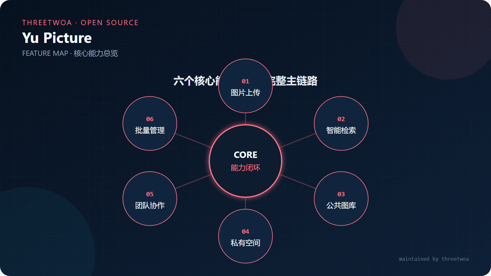
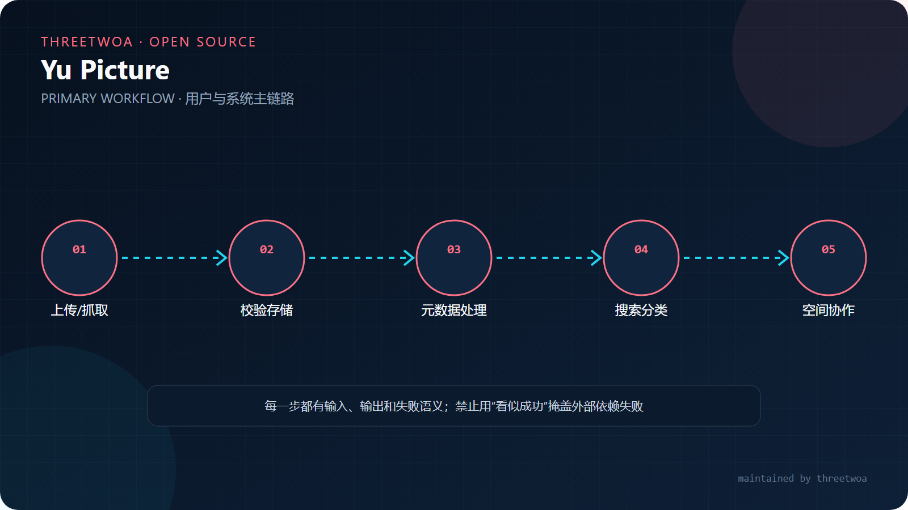
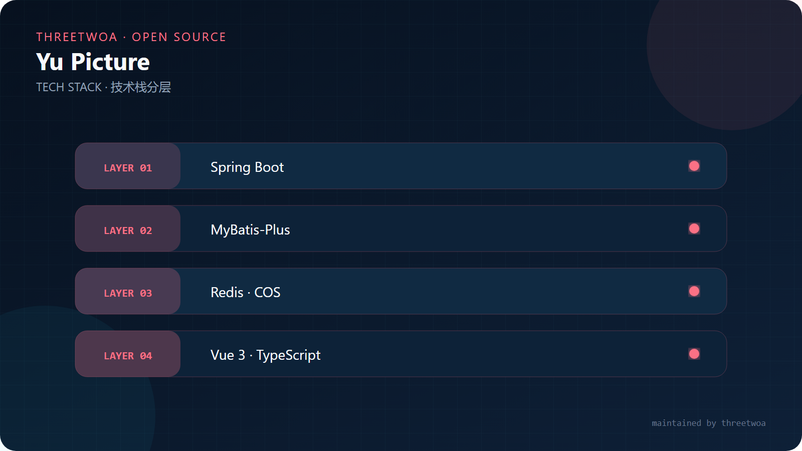
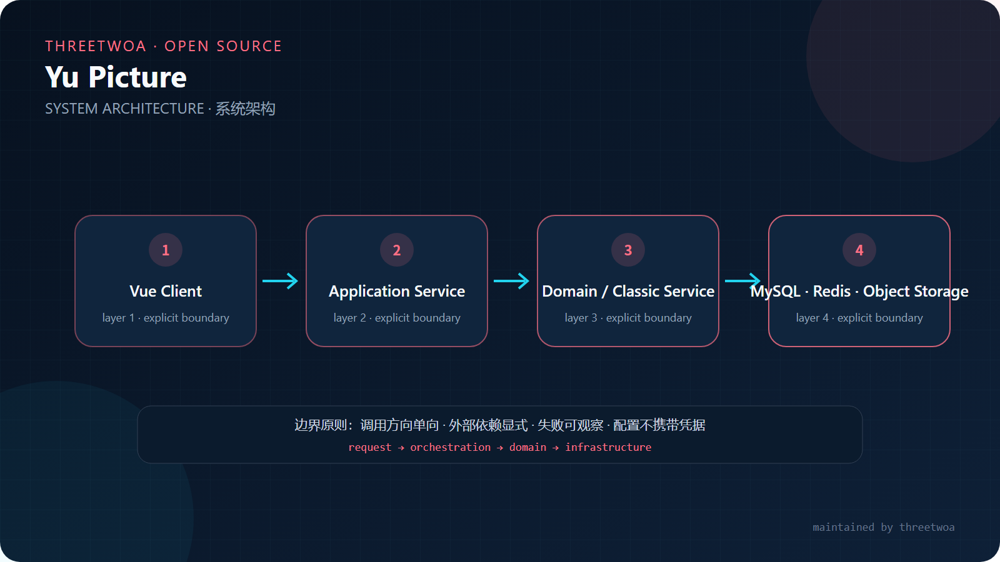
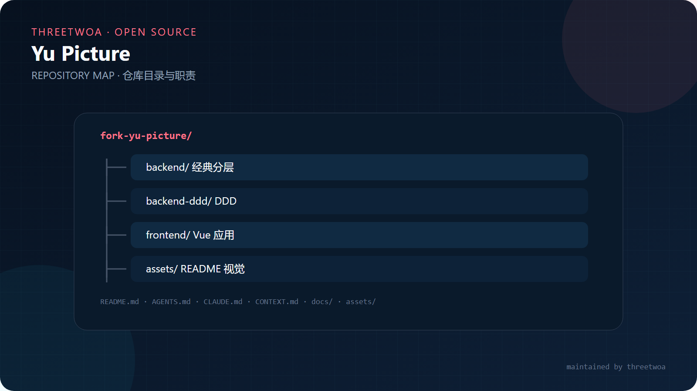

<div align="center">


# Yu Picture

### 面向个人与团队的智能图片资产平台

公共图库、私有空间、团队协作、内容审核与智能图片处理的一体化实现。

[能力](#能力矩阵) · [快速开始](#快速开始) · [架构](#架构与边界) · [阅读顺序](#模块阅读顺序) · [维护](#维护与许可)

</div>

> [!NOTE]
> 本仓库由 **threetwoa** 基于 [liyupi/yu-picture](https://github.com/liyupi/yu-picture) 开展二次开发。上游链接与许可证保留用于追溯来源；当前代码命名空间、维护文档和工程身份已迁移至 `threetwoa`。

## 产品边界

Yu Picture 管理图片从上传、解析、存储、检索到协作使用的完整生命周期。它负责业务权限、空间额度、图片元数据和处理任务编排；对象存储、数据库、缓存以及外部 AI 服务仍由各自基础设施提供，不应在仓库中提交真实密钥。

## 能力矩阵

<p align="center"></p>

| 能力 | 主要职责 | 实现入口 |
|---|---|---|
| 图片资产 | 上传、批量导入、编辑、删除、检索与审核 | `PictureController` / `PictureApplicationService` |
| 空间管理 | 私有空间、团队空间、容量与配额约束 | `SpaceService` / 空间领域服务 |
| 团队协作 | 成员、角色与图片操作权限 | DDD 权限领域与接口层 |
| 智能处理 | 扩图、颜色检索等异步能力 | 基础设施 API 与图片领域服务 |
| 双后端参考 | 传统分层与 DDD 两种实现可对照阅读 | `yu-picture-backend*` |

## 主链路

<p align="center"></p>

## 快速开始

```bash
git clone https://github.com/Aafff623/fork-yu-picture.git
cd fork-yu-picture/yu-picture-backend
mvn clean test
mvn spring-boot:run
```

前端：

```bash
cd yu-picture-frontend
npm install
npm run dev
```

启动前配置 MySQL、Redis、对象存储等本地参数。生产凭据必须通过环境变量或密钥管理服务注入。

## 技术栈

<p align="center"></p>

## 架构与边界

<p align="center"></p>

```text
Vue Web → Interfaces / Controller → Application Service
         → Domain Service → Repository / Mapper
         → Object Storage · Redis · MySQL · External AI API
```

DDD 版本中，接口层只处理协议与身份上下文；应用层编排用例；领域层维护图片、空间和权限规则；基础设施层封装数据库、缓存、对象存储及第三方 API。跨层调用应沿上述方向进行，避免领域对象依赖 Web 或 SDK 细节。

## 模块阅读顺序

<p align="center"></p>

| 顺序 | 模块 | 关注点 |
|---:|---|---|
| 1 | `yu-picture-frontend` | 页面路由、请求模型和用户操作链路 |
| 2 | `yu-picture-backend-ddd/interfaces` | HTTP 接口、请求校验与响应转换 |
| 3 | `application` | 上传、审核、删除、智能处理等用例编排 |
| 4 | `domain` | 图片、空间、用户及权限的核心规则 |
| 5 | `infrastructure` | Mapper、存储、缓存与外部服务适配 |
| 6 | `yu-picture-backend` | 与传统分层实现对照 |

## 验证与贡献

变更后至少运行受影响后端的 `mvn test` 与前端构建。功能调整应附边界说明和测试；配置变更不得包含真实账号、密钥或个人数据。

## 视觉画册

点击缩略图可查看原始矢量图：

| | |
|:---:|:---:|
| [](assets/images/readme/features.svg)<br>**Features** · 核心能力 | [](assets/images/readme/architecture.svg)<br>**Architecture** · 系统边界 |
| [](assets/images/readme/tech-stack.svg)<br>**Tech Stack** · 技术分层 | [](assets/images/readme/workflow.svg)<br>**Workflow** · 主链路 |
| [](assets/images/readme/structure.svg)<br>**Structure** · 仓库地图 | |

## 维护与许可

- 原作者：**李鱼皮（[liyupi](https://github.com/liyupi)）**
- 二次开发维护者：**threetwoa**
- 上游来源：[liyupi/yu-picture](https://github.com/liyupi/yu-picture)
- 许可证：以仓库内 `LICENSE` 与上游版权声明为准
